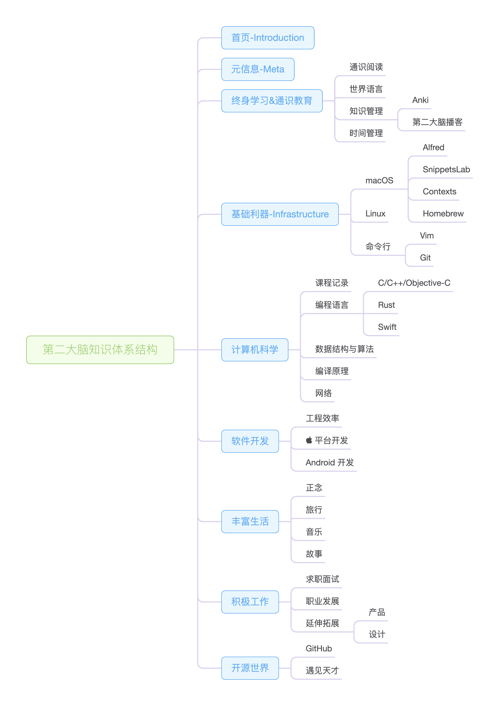

# 首页

Hi, there. 欢迎来到棒棒彬的第二大脑，藏在这儿都被你发现了，缘分有了，“飞起来”[交个朋友](https://www.feishu.cn/invitation/page/add_contact/?token=048m92c5-3f27-4519-90b6-ca498e852a45&unique_id=_mg4cY7_8zKNeA2a6eg0Bg==)吧。

这里会记录我希望记住的一些知识性的内容，不定时更新。

体系结构大致如下：

若能对路过的你也能帮助一二，那再好不过了。

## 使用说明

- 👈 通过侧边栏的层级导航菜单可以快速了解大概的知识体系
- 按下「S」键可快速搜索

## 技术参考周刊

> 分享个人技术见闻，棒棒彬的第二大脑**突触**

以知识增量的方式，从时间维度衍生的语雀在线周刊，欢迎 [关注订阅](https://www.yuque.com/binboy/increment-magzine)

## 关于我

若有兴趣了解和认识我，这儿有个「[年更博客](https://binlogo.github.io/)」。
