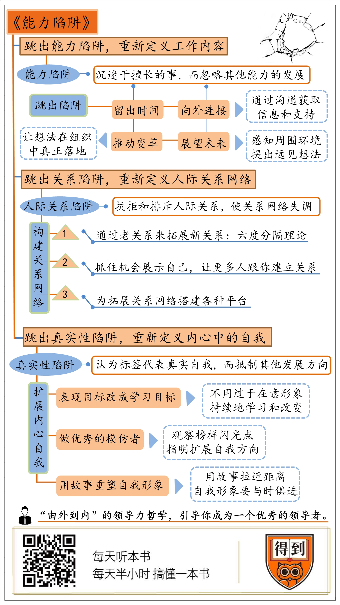

# 《能力陷阱》- 樊登精华解读

### 重新定义你的工作

**1.能力陷阱**

你一定有擅长的事情，你也一定喜欢它，因为它给你带来的成就感无与伦比。

我们很乐于去做那些我们擅长的事，于是就会一直去做，最终将使得我们一直只会擅长的那些事。做得越多，就越擅长。这样一个闭合循环如同吸毒一样，我们深深为之吸引，因为我们的快乐和自信都来源于它。它还会让我们产生误区，让我们相信我们擅长的事就是最有价值、最值得投入时间的。

久而久之，那些擅长的事务占据了我们绝大部分的时间，使我们无暇顾及其他更有意义、更有价值的事情。当我们正为我们期望的结果努力时，“能力陷阱”就会出现。当我们超额超量完成上级指派的任务时，由于表现良好且无可替代，而在领导力方面又有所欠缺，我们极有可能被留在原来的岗位上。

我们就这样被自身的优势和最擅长的技能禁锢住了。

**2.领导者的特征**

当我们从事日常工作时，思考的是“如何才能让工作做得更好？”；而当我们做领导者的工作时，思考的是“我们应该做出一些什么样的改变？”。领导者们通常会跨越职能范围去展望未来，或是投入到一些没有即时利益的事情上。

要像领导者一样行事，我们需要把时间花在以下这些事上：

**1）像桥梁一样连接不同的人或组织**

领导者有两种类型，一种是以团队和客户为工作重心的“中心型”领导者。这种领导者效率更高，对内部事务更为专注，会为团队设定目标，分派角色和任务，管理团队成员的表现并进行绩效评估。

另一种是把团队和外界相关组织联系起来的“桥梁型”领导者。他们更长于从外部获取想法和反馈，能将团队目标和组织的优先事务结合起来，向团队输送重要信息以确保进程。这类领导者比起中心型领导者，能更快地在创意产品和新颖服务的方面取得成绩。他们的成功秘诀需要归功于他们建立“桥梁”时所获得的外在表现力，能让那个他们在业务上提出新观点，有组织性地从大局看待问题，从而设定发展方向。

**2）做一些“有远见”的事情**

大多数人都能很容易地说出目前的工作中缺少什么，有什么不满意的地方或是无意义的地方，但是却没有一个“有远见性”的想法，他们的工作也因此停滞不前。

怎样才算有远见？以下是三种特征和具体的实施方法。

* 感知环境中的机遇和威胁：
  * 简化复杂环境
  * 联想一些表面上看起来似乎没有联系的事情
  * 预想可能触及组织底线的事

* 提供战略性指导：
  * 鼓励发展新业务
  * 定义新战略
  * 从大局的角度做决策

* 鼓励其他人展望未来
  * 提出一些挑战当前情况的想法
  * 接受成员提出的新的做事方式
  * 把外部观点传达给成员

**3）提升影响力**

某技术公司的部门经理的肯特弄不明白：在公司陷入困境时，他提出了一个清晰有力的想法，且精心制作了一组长而复杂的幻灯片给同事们展示。如此重要的事情，居然每个人都听着要睡着了。很多年以后，肯特明白过来了：他希望其他人都能同意他的想法，却没有真正说服他们同意——行就行，不行也没关系。

很多领导者会简单地认为想法本身就是最终卖点，但实际上，过程才是一个更为重要的因素。如何展现他们的想法以及在这个过程中他们如何与听众交流，决定了人们是否愿意和他一起做事。

领导者在推进项目或变动时，在关键步骤和展示风格上的表现，会影响人们对领导者的信心。换句话说，如果他们对领导者有信心，就会与之合作，从而增加成功的可能性。

**4）提升领袖气质**

研究者发现，当人们在某个“正确的时间”提出一些能引人注意的想法时，就会被认为有“领袖气质”。有魅力的领导者的特征是：有着建立在丰富的人生阅历上的坚定信念，会通过讲述个人故事来与他人良好交流，并且能做到知行合一。

**3.改变你的工作日程安排**

成为一名优秀的领导者，我们需要一种非常稀缺的资源——时间，来进行改变。但大多数人的时间已经被日常工作和即时需求占据，无暇思考我们是否把精力放在了正确的事情上。

有一家医院的病房资源十分有限。由于手术室全部排满，所以当有急诊时，医院只能把手术计划往后拖延。这样导致医务人员深夜还在做手术，其他工作人员也需要常常加班。医院也由此形成了一个低效又高压的工作氛围。

医院为此苦恼不已，从外部聘请了一位顾问。他提出了一个令人惊讶的解决方式：空出一间手术室来专门应对急诊病人。医院管理者们纷纷抱怨：已经这样忙了，还要空出一间手术室？太过分了！可是，自从这个手术室空出来以后，医务人员能更有效地处理一些紧急的病例，不用一直重新规划日程。他们的加班时间减少了，手术效率也提高了。

越是在忙碌的时候，越需要空出一些时间来应对一些意想不到的事情，比如提升自己的领导能力。与此同时，暂时先不用减少太多过去的旧工作。只有当新角色开始发挥效果时，你才会有动力放手从前那些阻碍你进步的日常工作。

### 建立良好的人际关系网络

**1.人际交往陷阱**

我们在人际交往中，出于“自恋原则”与“懒惰原则”，自然而然地会被那些与我们相似和地理位置相近的人吸引。因为我们需要依靠那些与自己相似的人，借此寻求安全感并获得肯定。而接触那些与自己地理位置相近的人，相对而言更轻松，不需要付出太多努力。

此外，许多人认为，人际网络本质是虚伪的，认为是在“利用别人”，认为带有目的性的人际交往让自己变得卑鄙、“不干净”，从而拒绝在舒适区域以外建立人际关系。

类似的情况还有：认为人际关系网络不具有实质性，认为经营人际关系网络耗时太长缺乏耐心，认为人际关系应该自然而然建立而不需要刻意经营。这些认知都会导致人们陷入人际关系的陷阱。它让你和你的团队都经不起外界环境的变化，留守在一个既舒适又封闭的圈子里，被突发情况打个措手不及。

但优秀的领导者们则不然。LinkedIn（领英）的创始人里德·霍夫曼曾经说过，扩展人际关系就像使用牙线清洁牙齿一样，一点也不好玩，但是很重要。领导者们利用人际关系网络感知发展趋势并寻找机会，与各领域的人才建立联系，跨领域合作以创造更多价值，避免陷入单一的、统一的群体性思维。借助这些拓展性关系，他们得以提出更多的突破性想法，并获取工作机会。

**2.评估你的人际关系**

人际关系可以分为三种类型：①保证你的工作能够良好运转的运营关系，②帮助提升个人发展空间的个人关系，③可以在未来发展道路上有所帮助的战略关系。而衡量人际关系网络的健康程度可以参照以下三个指标：

**1）广泛性**

一个广泛的人际关系网络，会联系起各行各业的人。然而，大部分人的关系网络都仅限于他们所在的专业领域、所在的部门以及公司，很少会接触到其他职能或是地理位置上距离相对较远的团队。

**2）连接性**

即作为桥梁连接一些在其他方面没有关联的人和团队的能力。社会学家用“密度”这个词来形容这种人际关系网络性质，指一个人际网络中人们互相认识的百分比。如果你认识的人彼此之间也互相认识，那么这就意味着你作为朋友间的关系枢纽，有着强大的连接性。

**3）动态性**

即能随着你的进步而发展的关系。那些我们所熟悉的人不一定能帮助我们成长。当我们换公司、换工作或是换常驻地时，过去的人际关系网络就会对我们造成限制。因为他们可能会不断地强调你想要摆脱的旧身份，甚至拼命地维持你的旧身份。

为了让你的人际关系能够适应未来，你需要建立并重视之前联系较弱的一些关系，即那些目前处于你人际关系网络外围的人或组织。

**3.打造良好的人际关系网络**

要想像一个领导者一样思考，首先我们需要建立一个新的人际关系网络。

**1）展示自我**

著名导演伍迪·艾伦有句名言：“成功的百分之八十在于自我表现。”（当然他还说过“有时候窝在床上会更简单，所以两件事我都做。”）

每个人都可以试着组织一场座谈会、介绍发言或是主持问答环节来扩展自己的人际关系网络。甚至一开始只是在座谈会上提出一个好的问题，你就能让别人知道你的名字和你的身份。把握住每一次发言的机会，人们会认识你，并且会以对你的了解来决定他们是否想要知道更多。

展现自我不能被动地等待活动的召唤，而是要主动出击，成为活动和派对的组织者。我们需要培养一个有联系性的大脑，去主动建立一个和之前不一样的人际关系网络，把人际关系圈延伸至全新的领域。

利用午餐和出差时间和一些不常见的人建立联系，借社交媒体来宣传个人兴趣爱好也是不错的选择。很多成功的管理者都会利用他们的个人兴趣来创建自己的团体，从中获取更多的资源和信息。

**2）利用你的二度分隔理论**

LinkedIn的创建者里德·霍夫曼发现，当你在职业上要寻求帮助时，最远不会超过三度，即我们通常只需要通过两个人就能与其他人取得联系。但是我们并未能很好地利用这些关系，因为我们大多数人都没有意识到我们的人际关系网络力量到底有多强大。

**3）维持关系**

构建人际网络不要等到急需帮助时再去建立联系，你需要时时保持人际关系的活力，并抓住每一次能发展它的机会，不管你当前需不需要用到它。

**4）找到志同道合的人**

改变自己最快的方法是与那些你想成为那样的人做朋友。因为朋友间的行为和观念会相互传染，你很容易会受到影响，这可能会让你变得更好，当然也可能变坏。与优秀的领导者在一起，成为优秀的领导者的几率也随之增加。

与一些志同道合的人相聚在一起，对于处于迷茫时期的你尤为重要。当我们需要一些不是轻易就能完成的事情时，我们难免产生信心的动摇。就像要戒酒一样，我们需要一些新的参照物，而那些成功转变了的人就能成为你转变路上重要的路标。

### 改变你做事的方法

**1.真实性陷阱**

有很多人认为，如果要根据环境而变换自己，会使得他们远离了自己最自然的风格，这是对他们真实性的一种威胁。这些“坚持真实者”的最大问题在于，他们是基于过去来定义真实性的，因此他们认为改变就意味着失去了真实性。而他们又将真实自我的范围扩张得极大，包括了价值观、领导、演讲、穿着以及行事风格等多重方面。

作者埃米尼亚·伊贝拉在哈佛大学给MBA学生上的第一堂课完全是一个灾难。彼时的她缺乏教学经验，无法组织高度互动的课堂讨论。沮丧的她收到了许多老教授的建议：你应该做真实的你自己。她依言而行，采用了与真实的她相匹配的教学方式：学术、严谨、严肃。但是课堂效果越来越糟糕。

备受打击的她去听了老教授们的课，发现他们的授课方式极具个性化。他们会结合自身的奇闻趣事和闹过的笑话，把课堂氛围营造得热闹活泼。而这样戏剧化的教学风格绝不是作者“做真实的自己”能表现得出来的。放弃“真实自我”的她试着转变风格。开始她觉得有些无所适从，不够自然，但一段时间以后，效果越来越好，课堂氛围也愈发有趣轻松。

**2.成为更好的你**

避免真实性陷阱的核心在于扩展自我概念。斯坦福心理学教授黑兹尔·马库斯的一些关于职业的研究发现，人们对自己的身份不仅仅基于过去和现在的自己，还同样基于对未来自己的展望。那个潜在的自己会引导着现在的你的行为，从而使你渐渐朝着你理想的自己而努力。因此，我们可以从以下三点入手，试着朝更多不同的方向发展自己。

**1）做个“随机应变者”**

与坚持真实者相对的是“随机应变者”。他们比别人更擅长角色的转变，且在转变时更加自然。他们愿意且能自如地适应环境的需求，同时不会产生一种觉得自己很虚伪的内疚感。他们有核心的自我价值观和目标，所以不担心转变会对自己的信仰造成影响。

被称为“变色龙”的美国前总统奥巴马就是一名随机应变者。一名评论家加里·威利斯将他总结为：“如果别人说他不是纯黑人血统，他就会告诉他们，他比大多数美国黑人和非洲的联系更直接；如果别人说他不完全是美国人，他就会说他的母亲来自美国中西部。他就像一只变色龙一样，不停地变化身上的颜色，但这并不意味着他不真诚，而是造就了他的与众不同。”

奥巴马不断地努力扩展自己的不同风格，还会根据听众来变换自己的演讲口音和节奏。给商人演讲，他就直截了当；给退伍军人做演讲，他则轻松随意。在变幻莫测的环境下，他知道自己应该要换上哪一层合适的皮肤。

如果我们把关注点从外在表现转变到要学习和追求的东西上，你将不再试着保护自己过去的身份，让其免受改变的威胁了。

**2）像艺术家一样偷师学艺**

即使是伟大的艺术家，也无法做到彻底的“原创”。作者在阅读过艺术家奥斯汀·克里昂的畅销书《像艺术家一样偷师学艺》后得出结论：没有什么是原创的。这位艺术家还提到，通过他的个人经历，他发现他是在动手去做事的过程中弄清楚他到底是谁的。

模仿榜样是一个很好的进步转变的方式。如果你把自己的身份认知当作游戏一样，你就会觉得直接从别人那里借鉴是可以的。但借鉴也有一个诀窍，那就是不要仅仅模仿一个人的全部，而是提取不同人的精华之处，再经过修改和改进从而得到自己独特的见解。就像作家威尔逊·米茨纳说的，如果你模仿一个作家，那就是剽窃；但是模仿很多个作家，那就是研究。

**3）灵活地讲述你的故事**

你每天都会有不一样的目标，你会一遍又一遍地重复，乃至改进你的故事。这并不是在做一些虚伪的事情，只是在确定新目标之前尝试不同的可能性。当你的目标改变时，你的故事也应该随之改变，这样，你的故事才能与你的新目标相关，从而赢得观众的共鸣。你不是去编一个小说，而是选择性地讲述那些对你产生积极影响的故事。

### 成为一名优秀领导者的进步阶段

很多改变的方法告诉你，你从开始就要想好改变后获得的结果是什么。但实际上，弄清楚你想要成为什么样的领导者是改变中最后一件需要做的事，而不是第一件。因为进步过程中可能有一些没有预想到的方式改变了你。

尽管你不能预测未来到底会是什么样的，但在转变过程中，你可能经历以下五个阶段。

**阶段一：发现差异**

成年人的学习和改变大多数时候都是从对自己不满意，或是觉得很迷茫开始的，他们发现了自己的期望与别人的评价之间的差异。而这个差异往往能激励我们开始付出行动。

**阶段二：只加不减**

很多人在开始练习一些新技能的时候，会发现自己比以前忙很多。因为我们不会立即中断从前那些有价值的工作。只有当新工作获得足够回报并能让我们坚持下去后，我们才会减少之前的工作。

**阶段三：混乱迷茫**

个人改变的道路都是曲折的。我们都天真地希望改变过程是不断前进的，可也都清楚地知道这是不现实的。也许是因为自己的决心无法支持我们继续完成改变，也许是因为身边的人认为我们做不到，或是不认可我们的改变。这些压力都会消磨我们想改变的决心。

**阶段四：重新设定前进方向**

混乱迷茫阶段产生的那些困惑，使得我们回过头来重新审视自己之前所定下的目标。因为在设定它们的时候，我们并没有考虑到新的行为方式符不符合我们的目标可能性，所以最后我们不得不改变目标。这个时候，我们开始把外在表现力内在化——反思、修改，再设定一条正确的前进方向。

**阶段五：内在化**

内在化是改变的必经一步，它能帮助人们从所知及所做进一步走向认识自己。比如，一名管理者也许知道，在她演讲时不应该只是对稿念，而是应该用一种富有激情的演讲方式来感染员工。但如果她将这种鼓舞人心以及关心员工的价值观内在化，她将比之前更能展现出激情和感染力，因为这种演讲方式符合她的价值观。

## 能力陷阱结语

遥望着那些卓有成就的人，我们一边羡慕，一边却总认为自己缺乏能力，即使付出努力也未必获得成功，不如不做。关于这一点，孔子对宰予的批评已经道出真相：“力不足者,中道而废,今汝画！”意为：如果真的是能力不足的人，做到一半才会力不从心而放弃；你却根本没有开始，这不过是画地为牢罢了。

而改变，最佳的时机是现在，最佳方式是——去做。

