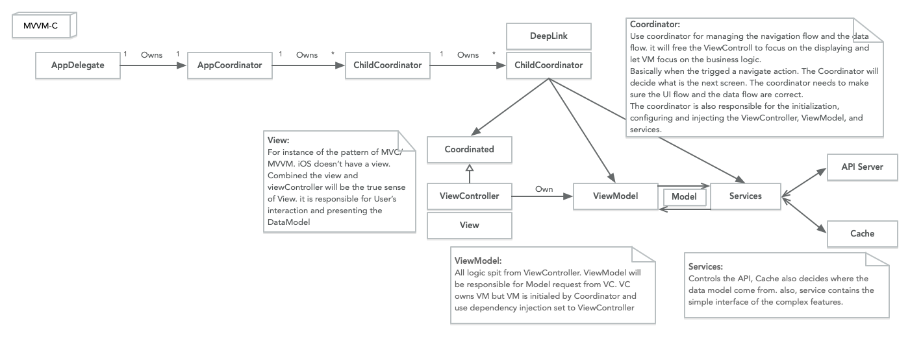

# 架构设计

从小茅屋到一座大厦。

推荐：[设计模式（Swift 5.0 实现）](https://github.com/Binlogo/Design-Patterns-In-Swift-CN)
## 链接

- [The Composable Architecture](https://github.com/pointfreeco/swift-composable-architecture)
- [Modern MVVM iOS App Architecture with Combine and SwiftUI](https://www.vadimbulavin.com/modern-mvvm-ios-app-architecture-with-combine-and-swiftui/)

### Swift 依赖注入框架

- [Swinject](https://github.com/Swinject/Swinject)
- [square/Cleanse](https://github.com/square/Cleanse) 
  - Doing

### 架构图

- MVVM-C —— [ProtonMail iOS](https://github.com/ProtonMail/ios-mail/blob/master/README.md#architecture)

> [MVVM-C](https://raw.githubusercontent.com/ProtonMail/ios-mail/master/mvvmc.png) with services. Model-View-ViewModel architecture, plus the Coordinator pattern. 

