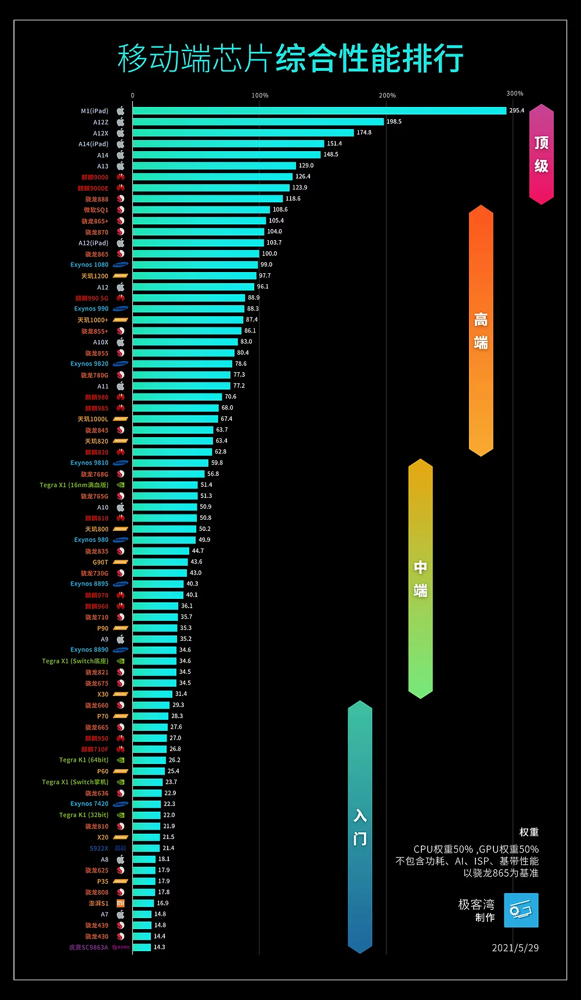

# 性能优化

> 极致，永无止境

## Apple WWDC & 文档
- [WWDC - Measuring Performance Using Logging](https://developer.apple.com/videos/play/wwdc2018/405)

- [Explore UI animation hitches and the render loop - Tech Talks - Videos - Apple Developer](https://developer.apple.com/videos/play/tech-talks/10855/)
- [Find and fix hitches in the commit phase - Tech Talks - Videos - Apple Developer](https://developer.apple.com/videos/play/tech-talks/10856)
- [Demystify and eliminate hitches in the render phase - Tech Talks - Videos - Apple Developer](https://developer.apple.com/videos/play/tech-talks/10857)
- [Reducing Your App’s Size](https://developer.apple.com/documentation/xcode/reducing-your-app-s-size)

### 内存

- [Detect and diagnose memory issues - WWDC21](https://developer.apple.com/videos/play/wwdc2021/10180/)
    - Perfermance XCTests collections
        - Ktrace files
        - Memory graph
    - MetricKit & Xcode Orgernizer
    - Issues to look
        - Leaks
        - Heap size issues
            * Heap allocation regression
                - `vmmap -summary ./PathToXXXXX.memgraph`
                - `heap -diffFrom=PathToXXXPre.memgraph PathToXXXPost.memgraph`
                - `heap -addresses=non-object[500k-] PathToXXX.memgraph`
                - `leaks --trackTree=0x1138XXXX PathToXXX.memgraph`
                - `leaks --referenceTree --groupByType PathToXXX.memgraph`
                - `malloc_history -fullStacks PathToXXX.memgraph 0x1138XXXX`
            * Fragmentation
                - Allocate object with similar lifetimes close to each other
                - Aim for 25% fragmentation or less
                - Use autorelease pools
                - Pay extra attention to long running processes
                - Use allocations track in Instruments
                    - ref: Getting Started with Instruments

- [Getting Started with Instruments - WWDC19](https://developer.apple.com/videos/play/wwdc2019/411)
- [iOS Memory Deep Dive - WWDC18](https://developer.apple.com/videos/play/wwdc2018/416)

### 包大小

- [ImageOptim](https://imageoptim.com/howto.html) - 图片资源大小、加载优化工具
## 书籍

- 《高性能 iOS 应用开发》- 各方面的性能衡量到工程实践
    > 注：看完本书不久，其中一位译者成为了我的 leader 😄

## Instrument 百宝箱

- [Instruments Help](https://help.apple.com/instruments/mac/current/)
- [Xcode Organizer](https://developer.apple.com/videos/play/wwdc2020/10076)

## 链接

- [移动芯片性能排行榜](https://www.socpk.com/)

