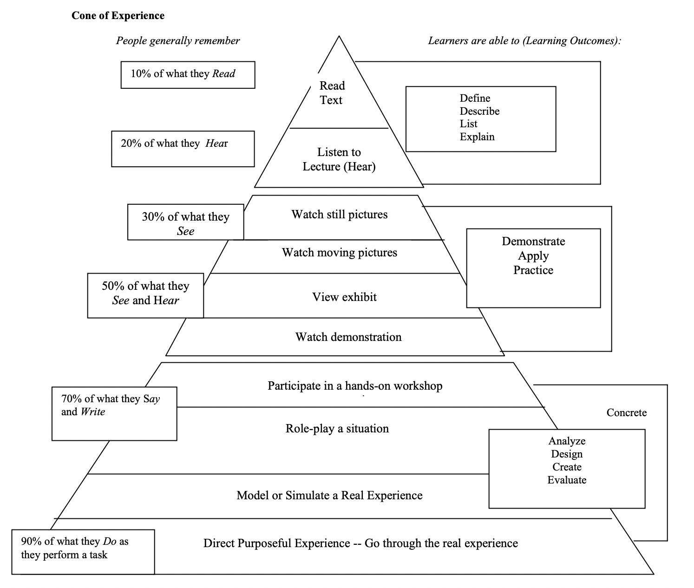
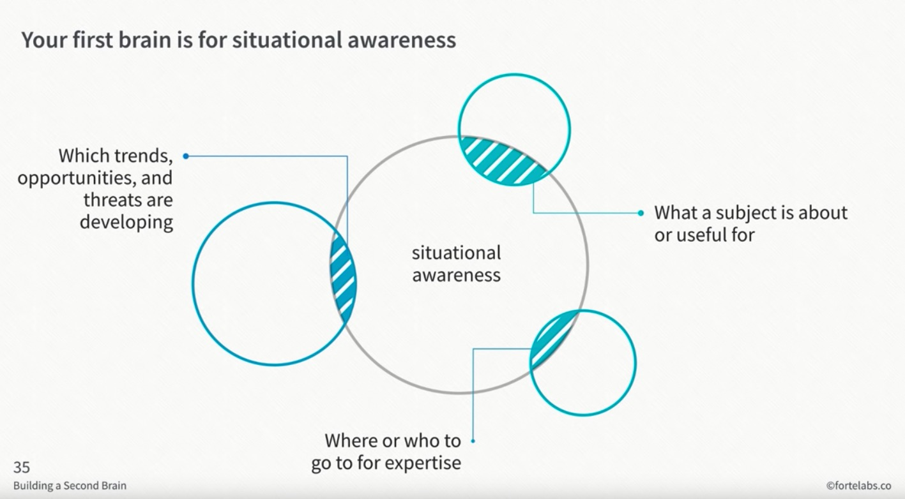
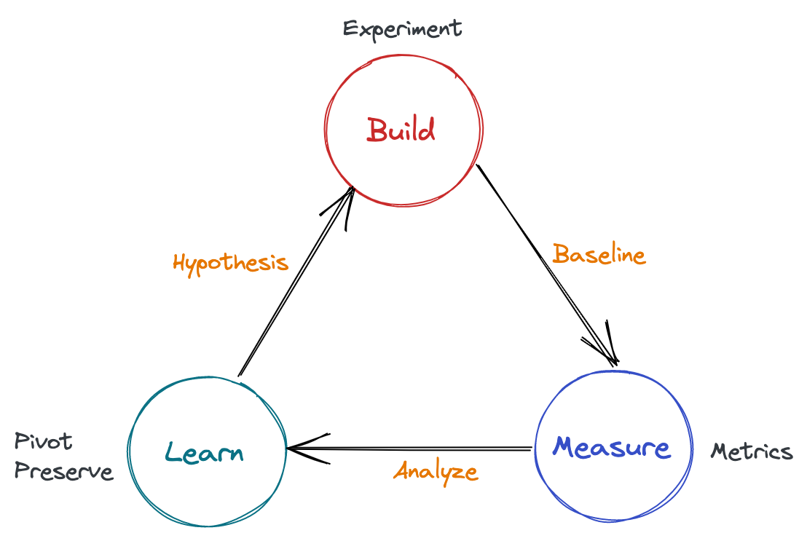
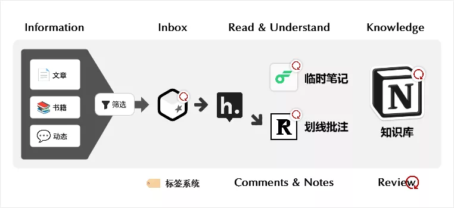

希望这里将会是我真正意义上的第二大脑。

> 弱水三千，取一瓢饮。

# 笔记流程

> Input -> Process -> Output

滴答清单输入，幕布加工，GitHub 输出

# 内容结构

1. 标题
2. 描述
3. 相关内容
4. 记录正文
5. 链接
6. 评论交流

> 评论系统采用 [giscus](https://giscus.app/) 搭建，基于 [GitHub Discussions](https://docs.github.com/discussions) 驱动

## 笔记概要

部分精华内容阅读后，可采用以下方式进行摘要记录，内容支持展开或折叠。
```html
<details>
  <summary>笔记概览</summary>
  
  记录笔记内容
</details>
```

# 搭建、记录与发布

- [VS Code](https://code.visualstudio.com/) + [Typora](https://typora.io/) 书写 ✍️

- [mdBook](https://github.com/rust-lang/mdBook) 生成 🧰

- [GitHub Pages](https://pages.github.com/) 发布 🌏

> 采用**免费的** [GitHub Actions](https://github.com/features/actions) 自动化部署

# 知识体系


### 知识栈的不同层级

```bash
（↑实践）
############################################################
L3 (domain knowlege)     | L3-1 | L3-2  |  |  L3-3 | L3-4 | 
#########################|##############|##|##############|#
L2 (practice knowledge)  |    L2-1      |  |     L2-2     | 
############################################################
L1 (general knowlege)
###################################
L0（low-level knowledge)
###########################
（↓理论）
```

* L0：底层基础层，一般而言较少直接触及，或者说多是潜移默化地应用
* L1：通用知识层，只要涉及当前领域就需要掌握的基础知识
* L2：实践层，在领域上的初步分化
* L3：领域层，专业细化的领域知识

# 学习金字塔理论

> 在初次学习两个星期后:
> - 通过阅读学习能够记住内容的 10%；
> - 通过听讲学习能够记住内容的 20%；
> - 通过图片学习能够记住内容的 30%；
> - 通过影像、展览、示范、现场观摩来学习能够记住 50%；
> - 参与讨论、提问、发言等方式能够记住 70%；
> - 做报告、教学、模拟体验、实际操作能够记住 90%。



主动学习：Learning by doing & sharing & teaching.

# 构建第二大脑

- [Building a Second Brain: Capturing, Organizing, and Sharing Knowledge Using Digital Notes](https://www.youtube.com/watch?v=SjZSy8s2VEE)


关键字：**记录**、**链接**、**激发**



关键字：**洞察**、**判断**、**觉知**

# 不断优化提升



> 源自: https://tyrchen.github.io/rust-training/rust-training-all-in-one-cn.html#4 

## 链接 

- [职场人士应该学什么以及学习方法（编码领域）](https://jingwei.link/2020/04/05/learning-methodology.html)
- [我们如何获取信息，组织知识](https://mp.weixin.qq.com/s/0tLF_cTbLGgQr1_-kNPFXg) - by 产品沉思录
- [我的阅读工作流(2021版)](https://mp.weixin.qq.com/s/lioyPd8RRv3XUyTkaJFDDQ) - by 潦草学者
  

### 其他大脑传送带

- [Everything I know by Nikita Voloboev](https://wiki.nikitavoloboev.xyz/) - 最初建设的重要灵感来源之一
- [David Seah](https://davidseah.gitbook.io/davidseah/)
