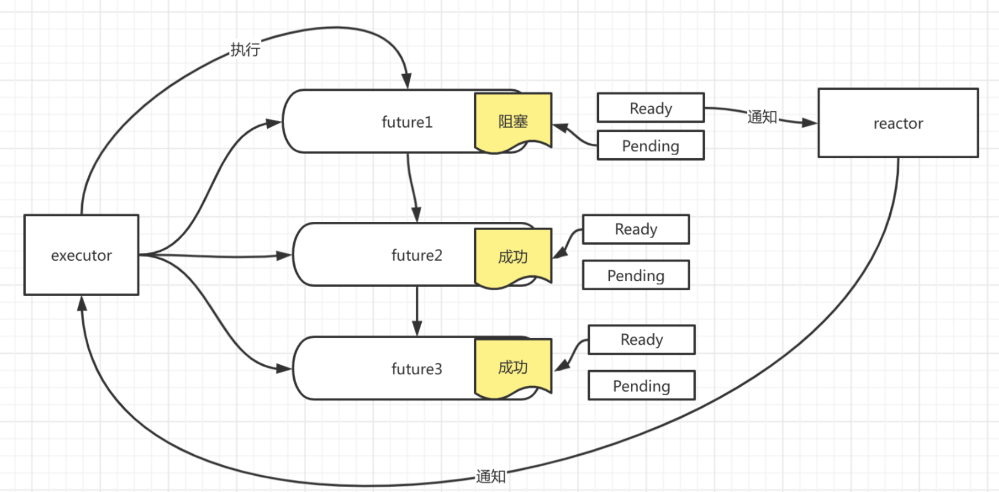

# Async/Await

> 美好值得等待🧐

## Future 异步编程模型

## 链接

- [x] [Rust & Tell Berlin September 2021 - Zeeshan Ali: Async/await: The good, bad and the ugly](https://youtu.be/x9D4pY-fkV0)
    <iframe width="560" height="315" src="https://www.youtube.com/embed/x9D4pY-fkV0?controls=0" title="YouTube video player" frameborder="0" allow="accelerometer; autoplay; clipboard-write; encrypted-media; gyroscope; picture-in-picture" allowfullscreen></iframe>

- [wg-async-foundations](https://rust-lang.github.io/wg-async-foundations/) - Async 工作组
    - [Async 里程碑与进展](https://rust-lang.github.io/async-fundamentals-initiative/)