# 认识与感受 Rust 的红与黑

## 写在前面

> 你如今的气质里，藏着你走过的路、读过的书、爱过的人，以及学习过的编程语言 😄


> 😝 趣图镇楼～ by [@Folyd](https://folyd.com/about/)

> **题外话**：欢迎一起交流&加入我们团队 😎

## 希望能解答的问题

1. 前期调研：感受 Rust 是一门什么样的编程语言
2. Rust 目前的发展状况
3. 是否真的有必要了解或学习

- （学不动了 🌫️

## 不太能解答的问题

1. 掌握甚至入门 Rust

- 若有意进一步学习，可跳转文档底部[参考]
- 若有任何问题，可随时评论交流

## Takeaway

> 一门赋予每个人构建可靠且高效软件能力的语言。—— [Rust 程序设计语言](https://www.rust-lang.org/zh-CN/)

- Rust 十分重视与强调开发者**用户体验**，拥有**友好**的编译器和清晰明确的错误提示与完整的文档
- Rust 采用强大的类型系统+所有权机制，兼具优异的**性能**、**安全**与丰富的语言抽象**表现力**
- Rust 是一门系统级的**通用**编程语言，**应用领域广泛**：嵌入式、操作系统，区块链、数据处理到网络应用、UI 编程、游戏等
- 个人体会：
  - Rust 像一个**始终在线**且**严格**的**优秀**导师，引导我写出更可靠而高效的代码
  - 掌握了 Swift 学习 Rust，迁移起来非常自然，且有助于更深入理解 Swift
  - C/C++ 的性能 + Swift 的安全保障与表现力

### 🚦Rust 的负面因素

- 对于链表这样存在环的数据结构，实现起来非常费劲（[链接参考](https://rust-unofficial.github.io/too-many-lists/)）
- 编译时间相比其他绝大多数语言要慢，编译器检查和全局性优化
- 编译器过于严格，甚至是啰嗦，虽然错误提示非常友好，但仍需要花时间适应
- 整个语言体系非常复杂，除了极为丰富的类型系统，还引入了诸多新语言特性和概念
  - 循循渐进地了解
- 目前来看，社区整体还较新的同时，Rust 狂热爱好者会显得过于追捧和激进（重构一切主义🙅‍♂️）
  - 因地制宜，权衡取舍，润物细无声


# **准备工具集**

- Rust (采用 Rustup 安装)
  - 推荐: [RsProxy](https://rsproxy.cn/) 镜像 By Bytedance.
- VSCode + [rust-analyzer](https://rust-analyzer.github.io/manual.html#vs-code) [+ crates]
- [Rust Search Extension](https://rust.extension.sh/)（可选&强烈推荐）

# Rust 初体验

采用 [Rust Playground](https://play.rust-lang.org/) 快速体验

- ### [Hello World](https://play.rust-lang.org/?version=nightly&mode=debug&edition=2021&gist=a0e2835842ac277af8a7f2bebe162239)

```Rust
fn hello(name: Option<&str>) {

    match name {

        Some(name) => println!("Hello, {}!", name),

        None => println!("Hello, World!"),

    }

}


fn main() {

    hello(None);

    hello(Some("Binlogo"));

}
```

- 类型系统强大，无 `null` 和 `void *` 等类型
- `Option` 类型用于表达`空`，编译时检查，避免运行时错误

- ### [翻转字符串](https://play.rust-lang.org/?version=stable&mode=debug&edition=2021&gist=9f9e2c47850eafb70d5b9b1f82c4c85c)

```Rust
fn reverse(input: &str) -> String {

    input.chars().filter(|c| !c.is_whitespace()).rev().collect()

}


fn main() {

    let s = "a1  b2  cdefg";

    println!("{}", reverse(&s));

}
```

- 代码抽象程度高，表达力强
- 高阶函数支持
- 实现以上两点的同时，没有运行时消耗（零成本抽象）

# Rust 的目标与设计理念

- **实用**的系统级编程语言

- 同时追求**安全**、**并发**、**高性能**

- 显式高于隐式

- 运行时行为可预测

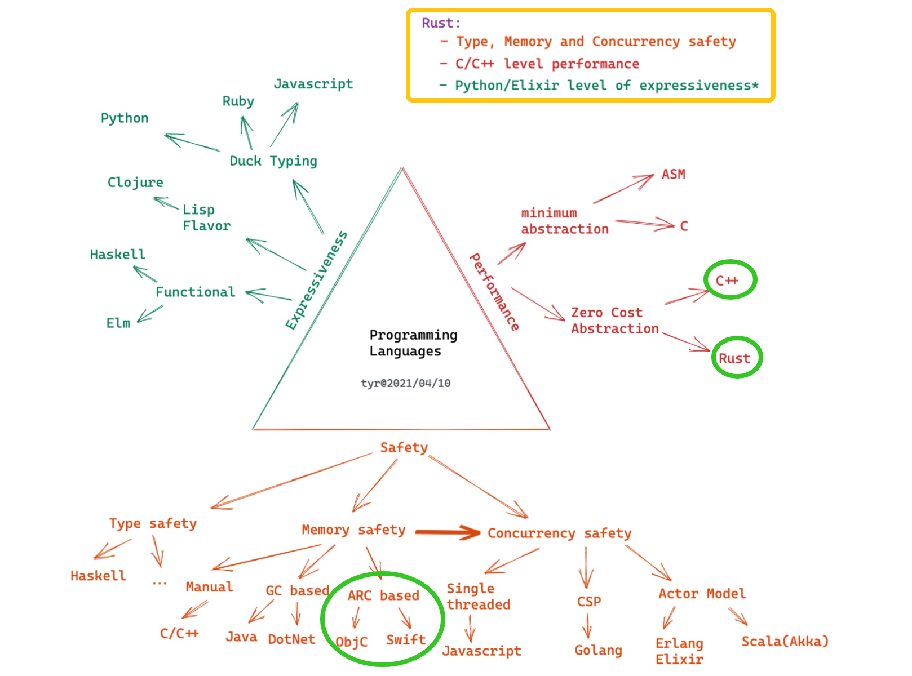

> 图源：https://tyrchen.github.io/rust-training/rust-training-all-in-one-cn.html#12


> 图源：https://livebook.manning.com/book/rust-in-action/chapter-1/121

## 安全

- 类型系统
  - 编译器检查，暴露隐含错误

- 编译器获取更多信息，利于优化

- 增强可读性，代码表达性强

- 所有权系统：每个被分配的内存都有一个独占其所有权的指针

- 借用和生命周期：每个变量都有其生命周期，借用可通过标记生命周期供编译检查

### 如何实现内存安全？

- **人工管理**：C/C++，难处理，易出错
- **智能指针**：C++/Objc/Swift，性能损失，循环引用问题
- **垃圾回收**：Java，大量内存消耗，不必要的堆内存分配
- **所有权模型（Ownership）**：Rust，学习曲线&理解成本

### 如何实现并发安全？

- 单线程

  ：JavaScript

  - 最安全的并发方式，但无法利用多核性能

- 全局解释器锁（GIL）

  ：Python/Ruby

  - 全局锁，以性能换安全
  - 锁粒度过大

- Actor Model

  ：Erlang/Swift(> 5.5)

  - 通过消息同步（actor -> actor)
  - 额外内存拷贝和堆内存分配

- Communicating Sequential Process (CSP)

  ：Golang

  - 通过消息同步（coroutine -> channel -> coroutine)
  - 额外内存拷贝和堆内存分配

- **所有权模型 + 类型系统**

  ：Rust

  - 通过类型安全保证
  - 无性能损失，且可以与其他方式兼容，如 `std::sync::mpsc` 

## 零成本抽象（性能）

```Rust
// Rust

fn main() {

    6.times(|_| println!("6"));

}


pub trait Times where Self: Sized {

    fn times<F: FnMut(Self)>(&self, closure: F);

}


macro_rules! impl_times {

    ($ptype:ty) => {

        impl Times for $ptype {

            fn times<F: FnMut($ptype)>(&self, mut closure: F) {

                for i in 0..*self {

                    closure(i)

                }

            }

        }

    }

}


impl_times!(i8);

impl_times!(u8);

impl_times!(i16);

impl_times!(u16);

impl_times!(i32);

impl_times!(u32);

impl_times!(i64);

impl_times!(u64);

impl_times!(usize);
```

- 不存在运行时性能开销，编译时完成
- 语言特性基石：泛型和 `trait`

### 性能对比

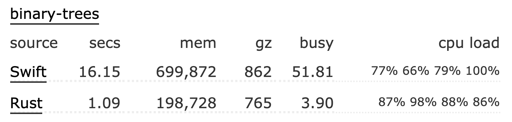

> 来源：[Swift vs Rust - Which programs are fastest? | Computer Language Benchmarks Game](https://benchmarksgame-team.pages.debian.net/benchmarksgame/fastest/swift-rust.html)

## 实用性

- 友好的 FFI 支持，可以很好利用已有 C/C++ 等生态

- 包管理器 Cargo 及其**一致的工作流**

- 强大智能的编译器错误提示机制

### 工具链

- Rustup

  : 工具链安装与版本管理

  - rustc - Rust 编译器
  - **cargo** - Rust 构建与包管理工具
    - 两个关键文件：`Cargo.toml` 和 `Cargo.lock`
    - `cargo build` —— 编译
    - `cargo run` —— 运行
    - `cargo test` —— 测试
    - `cargo tree` —— 解析依赖树
    - 更多：[The Cargo Book](https://doc.rust-lang.org/cargo/index.html)
  - rustdoc - Rust 文档工具
  - rust-(lldb|gdb)
  - libcore/libstd 

- 常用命令

  - `rustup install stable`
  - `rustup default stable`
  - `rustup doc [--std]`
  - `rustup override set stable`
  - `rustup target list`
  - `rustup target add armv7-apple-ios` - 添加交叉编译的目标支持

- 添加其他辅助工具

  - `rustup component add rustfmt` - Rust 代码自动格式化
  - `rustup component add clippy` - Rust 代码检查与优化

### 丰富的文档

> [Learn Rust](https://www.rust-lang.org/learn)

- 官方指南
  - [Rust 程序设计语言](https://doc.rust-lang.org/book/)
  - [Rustlings](https://github.com/rust-lang/rustlings/) - Rust 练习集
  - [通过示例学 Rust](https://doc.rust-lang.org/stable/rust-by-example/)
- 核心文档
  - [标准库](https://doc.rust-lang.org/std/index.html) - Rust 标准库 API 手册
  - [版本指南](https://doc.rust-lang.org/edition-guide/index.html)
  - [Cargo 手册](https://doc.rust-lang.org/cargo/index.html) - Rust 包管理器与构建系统
  - [Rustdoc 手册](https://doc.rust-lang.org/rustdoc/index.html)
  - [编译错误索引表](https://doc.rust-lang.org/error-index.html)  - 深入解释可能遇到的编译错误
- 进阶文档
  - [Rust 参考手册](https://doc.rust-lang.org/reference/index.html) - 深入语言设计原理与实现细节
  - [Rust 黑魔法手册](https://doc.rust-lang.org/nomicon/index.html) - 如何更灵活地应用「不安全」的 Rust
  - [未稳定特性手册](https://doc.rust-lang.org/nightly/unstable-book/index.html) - 了解通过特性开关开启的语言特性
- 除此以外，所有的三方库都有一致的发布平台和文档中心：
  - [crates.io: Rust Package Registry](https://crates.io/)
  - [Docs.rs](https://docs.rs/)

### 版本兼容性

- 基于版次（Edition）的引入，稳定版 Rust 将始终向后兼容。—— **No Rust 2.0**
  - 与此同时，`cargo fix --edition` 支持快速迁移

### 跨平台特性

Rust 是对标 C/C++ 的系统级编程语言，理论上可以应用到各个领域。就移动端应用领域而言，目前跨平台的编程语言以 C++ 为主，例如较为主流的 Facebook 的跨平台布局框架 Yoga，腾讯微信的跨平台网络库 mars。而 Rust 是一门对 FFI 良好支持的系统级语言，既能够和 Swift/Kotlin 等平台支持语言一样有良好的抽象和表达性，又能够达到 C/C++ 的性能的同时，还可以在编译期保证安全。因此，如果团队合适，又有跨平台的开发需求，那么 Rust 会是个不错的可选项。

#### 较为流行与成熟的跨平台开源项目

- GitHub - mozilla/application-services: Firefox Application Services
  - Firefox 的应用服务层，供 Android/iOS/Desktop 各端使用
- GitHub - signalapp/libsignal-client
  - Signal 应用跨平台层，供 Android/iOS/Desktop 各端使用

# Rust 的工作流程与社区生态建设

开源[治理](https://www.rust-lang.org/zh-CN/governance) · [社区](https://www.rust-lang.org/zh-CN/community)文化建设&驱动 · [基金会](https://foundation.rust-lang.org/)支持

- [RFC](https://github.com/rust-lang/rfcs)：Rust 中的每个重要决定都是从征求意见稿（RFC）开始的。 任何人都可以参与提案的讨论，权衡利弊以便达成共识。 对每个语言特性，社区都集思广益、深思熟虑，保证 Rust 高质量迭代。
- 通过 RFC 流程机制，制定[年度路线图](https://github.com/rust-lang/rfcs/blob/master/text/3037-roadmap-2021.md)：确保研发流程的专注

## 团队构成与分工：

| 核心团队       | 关注项目的整体及跨领域方向，管理子工作组。                   |
| -------------- | ------------------------------------------------------------ |
| 社区团队       | 协调并支持活动，运营 RustBridge 项目以及开展调查研究。       |
| 编译器团队     | 编译器内部结构和优化                                         |
| Crates.io 团队 | 管理 [crates.io](https://crates.io/) （社区三方库）的运维、开发和相关政策。 |
| 开发工具团队   | Rust 开发者工具                                              |
| 基础架构团队   | Rust 项目自身所需的各种基础设施：持续集成、版本管理、机器人和性能指标。 |
| 语言团队       | 设计新的语言特性                                             |
| 库团队         | Rust 标准库、rust-lang 包、代码约定以及生态的支持。          |
| 审查团队       | 帮助维护行为准则                                             |
| 发布团队       | 跟踪回归测试，稳定化并发布 Rust。                            |

- 团队中的每个成员都可以通过 GitHub 找到他们
- 「[跨团队协作欢乐时光](https://rust-ctcft.github.io/ctcft/)」会议：类似字节的技术双月会

# 生产环境采用 Rust 的用户和产品

> [Production users](https://www.rust-lang.org/production/users)

- Android - [Android Rust Introduction](https://source.android.com/setup/build/rust/building-rust-modules/overview)
- Atlassian - [Why we chose Rust as our programming language](https://bitbucket.org/blog/why-rust)
- Coursera - [Rust & Docker in production @ Coursera](https://medium.com/coursera-engineering/rust-docker-in-production-coursera-f7841d88e6ed)
- Dropbox - [Rewriting the heart of our sync engine](https://dropbox.tech/infrastructure/rewriting-the-heart-of-our-sync-engine)
- Figma - [How Mozilla’s Rust dramatically improved our server-side performance](https://www.figma.com/blog/rust-in-production-at-figma/)
- Fuchsia OS - [Fuchisia Rust Introduction](https://fuchsia.dev/fuchsia-src/development/languages/rust)
- Sourcegraph - [Syntect Server](https://github.com/sourcegraph/sourcegraph/tree/main/docker-images/syntax-highlighter)
- Lark/飞书 - [Rust 跨平台客户端开发在字节跳动的实践-InfoQ](https://www.infoq.cn/article/oh79weak7z3s2xavo*bv)
- npm, Inc - [Community makes Rust an easy choice for npm](https://www.rust-lang.org/static/pdfs/Rust-npm-Whitepaper.pdf)
- ......

# Rust 核心语言特性

## 所有权&借用规则

> Rust 内存管理的基础模型

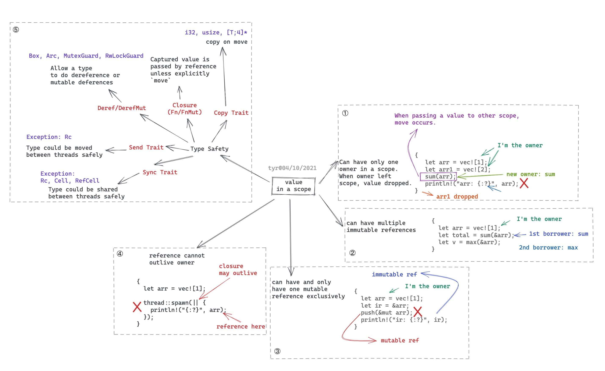

> 图源：https://tyrchen.github.io/rust-training/rust-training-all-in-one-cn.html#39

和垃圾回收、自动引用计数类似，只是一种内存管理和控制的方式：

- 给了内存安全+并发安全在编译时检查空间
- 付出了编码时更多的考虑（即编译器更多限制）

### 所有权规则（Ownership）

- 一个值只有一个所有者（owner）
- 所有权（ownership）可以传递（move）给函数和其他变量
- 所有者负责从内存中删除数据
- 所有者能够对数据进行任何操作并可以对其进行修改

#### [代码示例](https://play.rust-lang.org/?version=stable&mode=debug&edition=2018&gist=3ce7843bec063a54c36330f9b9bed5e1)

```Rust
#[derive(Debug)]

struct Dot {

    id: String,

    x: i32,

    y: i32

}


fn main() {

    let dot = Dot { id: "dot_1".to_string(), x: 1, y: 2 }; 

    pacman(dot);

    // 若尝试再次调用，则报错，见下图

    // pacman(dot);

}


fn pacman(dot: Dot) { 

    println!("Eating {:?}", dot);

    

}
```

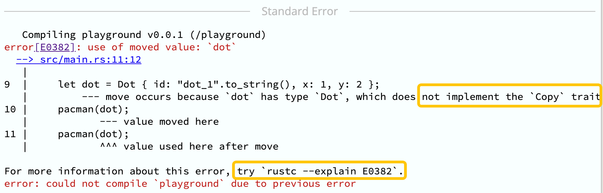

- 编译错误索引：[[E0382\]](https://doc.rust-lang.org/stable/error-index.html#E0382)

#### 内存生命周期示意

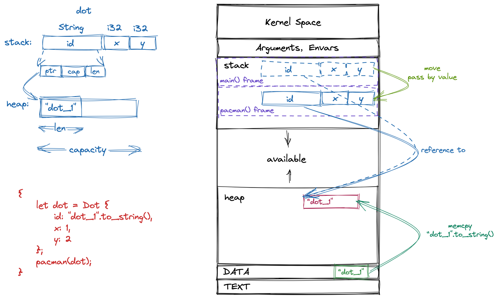

- 当 `pacman` 函数 return，`dot` 对象（如同局部变量一样）将随着整个调用栈帧回收释放(`drop`)

#### 如何处理所有权被转移的情况（[[E0382\]](https://doc.rust-lang.org/stable/error-index.html#E0382)）

- ##### 显示调用 `.clone()` 进行克隆，对内存进行拷贝传递

```Rust
#[derive(Debug, Clone)]

struct Dot {

    id: String,

    x: i32,

    y: i32

}


fn main() {

    let dot = Dot { id: "dot_1".to_string(), x: 1, y: 2 }; 

    pacman(dot.clone());

    // 再次调用，编译通过 ✅

    pacman(dot);

}


fn pacman(dot: Dot) { 

    println!("Eating {:?}", dot);

    

}
```

- ##### 对数据类型实现 `Copy` trait，表明该类型可以简单通过位复制创造副本

  - 实现了 `Copy` trait 的数据类型，将默认通过「值拷贝」语义进行参数传递

```Rust
#[derive(Debug, Clone, Copy)]

struct Dot {

    id: String,

    x: i32,

    y: i32

}


fn main() {

    let dot = Dot { id: "dot_1".to_string(), x: 1, y: 2 }; 

    pacman(dot); // 实现了 Copy trait，默认通过「值拷贝」传递

    // 再次调用，编译通过 ✅

    pacman(dot);

}


fn pacman(dot: Dot) { 

    println!("Eating {:?}", dot);

    

}
```

- ##### 通过借用（Borrow），在避免所有权转移的情况下共用数据

### 借用（Borrowing）

> `&`：借用操作符，与引用的区别，在于「借用」受一定规则约束

- #### 不可变借用(`&`)

  - 可多次借用，不可对数据进行修改
  - 引用将始终有效，不会为 null 或野指针（即不会超过数据的生命周期）
  - 借用的有效期间，确保引用的数据不会发生突变

[代码示例](https://play.rust-lang.org/?version=stable&edition=2018&code=%23[derive(Debug)] struct Point {    x%3A i32%2C    y%3A i32 } fn main() {    let mut p %3D Point { x%3A 1%2C y%3A 2 }%3B     inspect(%26p)%3B     p.x %3D 2%3B     inspect(%26p)%3B     } fn inspect(p%3A %26Point) {     println!("{%3A%3F}"%2C p)%3B })：

```Rust
#[derive(Debug)]

struct Point {

    x: i32,

    y: i32

}


fn main() {

    let mut p = Point { x: 1, y: 2 }; 

    inspect(&p); 

    p.x = 2; 

    inspect(&p);

    

}


fn inspect(p: &Point) { 

    println!("{:?}", p);

}
```

[代码示例](https://play.rust-lang.org/?version=stable&mode=debug&edition=2018&gist=d62bdd044f9f672592b2e9d51967f1fc)：

```Rust
#[derive(Debug)]

struct Point {

    x: i32,

    y: i32

}


fn main() {

    let mut point = Point { x: 1, y: 2 };

    let re = &point; // -\ 

    point.x = 2;     //  | 

    inspect(re);     // -/ 

}


fn inspect(p: &Point) { 

    println!("{:?}", p);

}
```

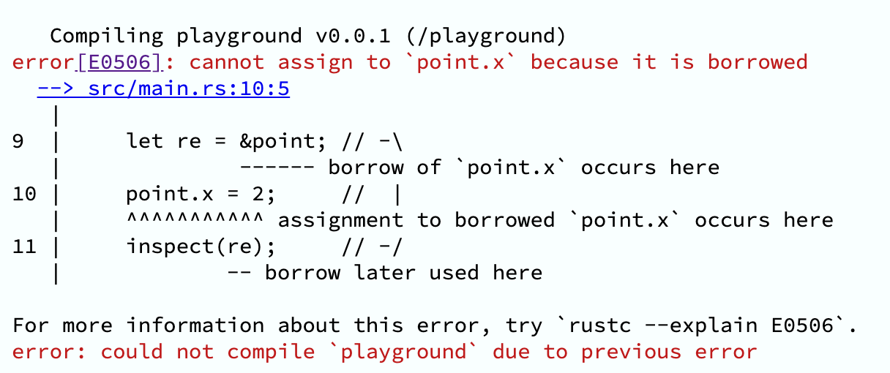

- 编译错误索引：[[E0506\]](https://doc.rust-lang.org/stable/error-index.html#E0506)

- #### 可变借用（`&mut`）

  - 仅支持一次可变借用，可对数据进行修改

```Rust
fn main() {

    let mut p = Point { x: 1, y: 2 };

    inspect(&p); 

    move_point(&mut p, 3, 3); 

    inspect(&p); 

}


fn move_point(

    p: &mut Point,  

    x: i32, y: i32

) {

    p.x = x;

    p.y = y;

}
```

- #### 借用规则

  - 多次不可变借用
  - 仅单个可变借用
  - 以上两者互斥，即无法共享可变性
  - 借用的生命周期无法超过值本身的生命周期

## 生命周期

> 生命周期是个心智负担较重的概念，但好在大多数时候编译器，都能自动识别生命周期，不需要额外标注。可先仅作了解，后续再深入。

- 描述标注借用的值在内存中存活的时间范围，即变量的有效范围
- 主要作用是避免指针失效/悬垂引用
- 仅仅是描述和标注，以便编译器做安全检查，不会强制改变固有的生命周期逻辑
- 语法上，与范型相似

### 静态与动态生命周期

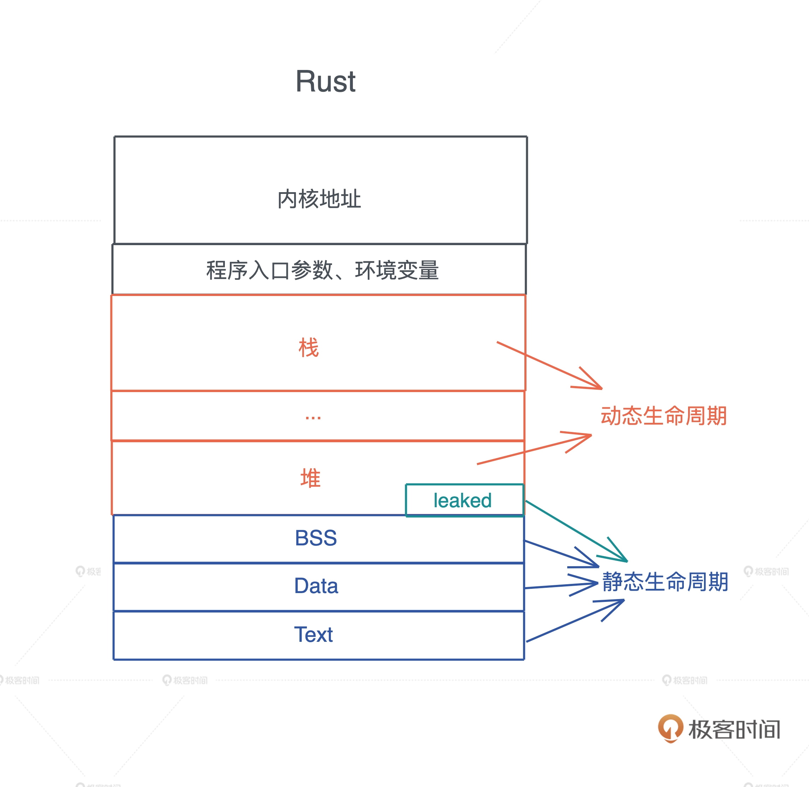

- 分配在堆和栈上的内存有其各自的**作用域**，生命周期是动态的。
- 全局变量、静态变量、字符串字面量、代码等内容，在编译时，会被编译到可执行文件中，加载入内存。生命周期和进程的生命周期一致，生命周期是静态的。
- 函数指针的生命周期也是静态的，因为函数在 Text 段中，只要进程活着，其内存一直存在。

### 代码示例

```Rust
fn main() {

    let s1 = String::from("Lindsey");

    let s2 = String::from("Rosie");

    let result = max(&s1, &s2);

    println!("bigger one: {}", result);

}


fn max(s1: & str, s2: & str) -> &str {

    if s1 > s2 {

        s1

    } else {

        s2

    }

}
```

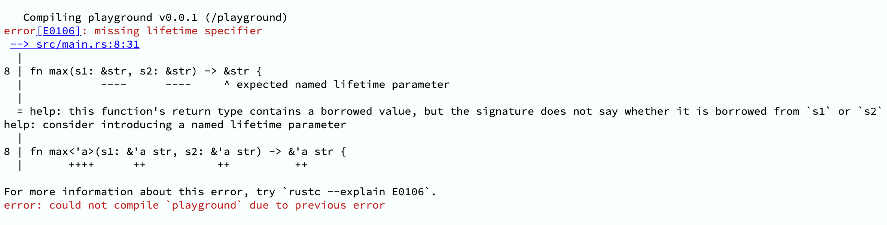

- 编译错误索引： [[E0106\]](https://doc.rust-lang.org/stable/error-index.html#E0106): missing lifetime specifier

#### 根据编译器报错引导，添加生命周期标注

```Rust
fn max<'a>(s1: &'a str, s2: &'a str) -> &'a str
```

# Rust 实战（Live Coding）

## rusty-todo-cli：代办清单 CLI 工具

- 创建事项：`add "Rust sharing for genius bytedancers"`
- 查看事项列表：`list`
- 完成事项: `done [index]`
- 持久化：
  - 通过 JSON 文件保存
  - 默认路径：用户目录，可选文件路径指定

1. ### 创建项目

```Bash
cargo new rusty-todo-cli
```

1. ### 依赖安装

```Rust
[package]

name = "rusty-todo-cli"

version = "0.1.0"

edition = "2021"


# See more keys and their definitions at https://doc.rust-lang.org/cargo/reference/manifest.html


[dependencies]

anyhow = "1.0" # 错误处理

structopt = "0.3" # 命令定义

serde = { version = "1.0", features = ["derive"] } # 序列化/反序列化

serde_json = "1.0" # JSON 解析

chrono = { version = "0.4", features = ["serde"] } # 时间解析

home = "0.5" # 默认存储目录
```

1. ### 定义命令

> Doc: **[structopt - Rust](https://docs.rs/structopt/0.3.25/structopt/#how-to-derivestructopt)**

```Rust
use std::path::PathBuf;


pub enum Action {

    List,

    Add { text: String },

    Done { index: usize },

}


pub struct CommandLineOptions {

    action: Action,

    json_file_path: Option<PathBuf>,

}
```

- cli.rs

```Rust
use std::path::PathBuf;

use structopt::StructOpt;


#[derive(Debug, StructOpt)]

pub enum Action {

    List,

    Add {

        #[structopt()]

        text: String,

    },

    Done {

        #[structopt()]

        index: usize,

    },

}


#[derive(Debug, StructOpt)]

#[structopt(name = "rusty-todo", about = "A command line todo app")]

pub struct CommandLineOptions {

    #[structopt(subcommand)]

    action: Action,

    #[structopt(parse(from_os_str), short = "p", long = "path")]

    json_file_path: Option<PathBuf>,

}
```

- main.rs

```Rust
mod cli;

use cli::*;

use structopt::StructOpt;


fn main() {

    let CommandLineOptions {

        action,

        json_file_path,

    } = CommandLineOptions::from_args();


    println!("JSON file path: {:?}", json_file_path);

    match action {

        Action::List => println!("List all"),

        Action::Add { text } => println!("Add: {:?}", text),

        Action::Done { index } => println!("Done: {:?}", index),

    }

}
```

#### 运行

> ```
> cargo run -- add "Rust sharing for genius bytedancers"
> ```

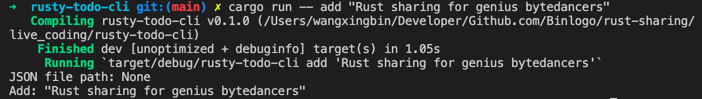

1. ### 功能实现：Happy CRUD 🚀

- #### 设计数据结构

```Rust
use chrono::{DateTime, Utc};


pub struct Task {

    pub text: String,

    pub created_at: DateTime<Utc>,

}
use chrono::{serde::ts_seconds, DateTime, Utc};

use serde::{Deserialize, Serialize};


#[derive(Debug, Deserialize, Serialize)]

pub struct Task {

    pub text: String,

    #[serde(with = "ts_seconds")]

    pub created_at: DateTime<Utc>,

}


impl Task {

    pub fn new(text: String) -> Self {

        Self {

            text,

            created_at: Utc::now(),

        }

    }

}
```

- #### 添加任务

  - task.rs

```Rust
pub fn add_task(task: Task, json_file_path: PathBuf) -> Result<()> {

    let file = OpenOptions::new()

        .read(true)

        .write(true)

        .create(true)

        .open(json_file_path)?;

    let mut tasks = parse_tasks(&file)?;

    tasks.push(task);

    serde_json::to_writer(&file, &tasks)?;

    Ok(())

}


fn parse_tasks(file: &std::fs::File) -> Result<Vec<Task>> {

    let reader = BufReader::new(file);

    let tasks = serde_json::from_reader(reader)?;

    Ok(tasks)

}
```

- main.rs

```Rust
mod cli;

mod tasks;

use anyhow::{anyhow, Result};

use cli::*;

use std::path::PathBuf;

use structopt::StructOpt;

use tasks::*;


fn main() -> Result<()> {

    let CommandLineOptions {

        action,

        json_file_path,

    } = CommandLineOptions::from_args();


    let json_file_path = json_file_path

        .or_else(default_json_file_path)

        .ok_or(anyhow!("文件路径查找失败"))?;

    match action {

        Action::List => println!("List all"),

        Action::Add { text } => add_task(Task::new(text), json_file_path)?,

        Action::Done { index } => println!("Done: {:?}", index),

    }

    Ok(())

}


fn default_json_file_path() -> Option<PathBuf> {

    home::home_dir().map(|mut path| {

        path.push(".rusty-todo.json");

        path

    })

}
```

##### 运行

> cargo run -- add "Rust sharing for genius bytedancers"

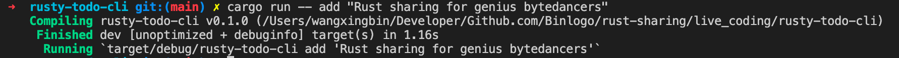

默认用户目录下：

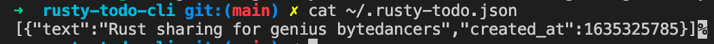

🎉🎉🎉 添加任务成功

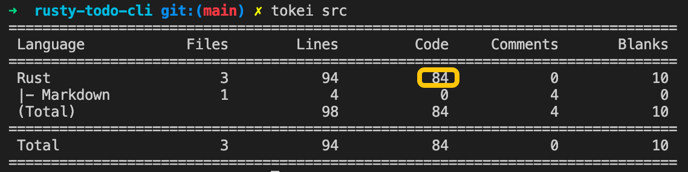

- #### 查看任务

  - tasks.rs

```Rust
impl Display for Task {

    fn fmt(&self, f: &mut std::fmt::Formatter<'_>) -> std::fmt::Result {

        write!(f, "{:<50} [{}]", self.text, self.created_at)

    }

}


pub fn list_tasks(json_file_path: PathBuf) -> Result<()> {

    let file = OpenOptions::new().read(true).open(json_file_path)?;

    let tasks = parse_tasks(&file)?;

    if tasks.is_empty() {

        println!("待办事项为空，好好休息下吧～🎉")

    } else {

        for (index, task) in tasks.into_iter().enumerate() {

            println!("{}: {}", index, task);

        }

    }

    Ok(())

}
```

- main.rs

```Rust
    match action {

        Action::List => list_tasks(json_file_path)?,

        Action::Add { text } => add_task(Task::new(text), json_file_path)?,

        Action::Done { index } => println!("Done: {:?}", index),

    }
```

##### 运行

> cargo run -- list

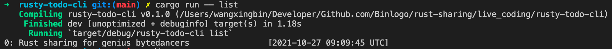

- #### 删除任务

略：动手尝试下吧！

> 附：[查阅](https://github.com/Binlogo/playground-rs/tree/master/rusty-journal)此次 Live Coding 代码

# 参考

- [2021年 Rust 行业调研报告-InfoQ](https://www.infoq.cn/article/umqbighceoa81yij7uyg)

- [棒棒彬的第二大脑-编程语言-Rust](https://binlogo.github.io/Knowledge-Track/programming-languages/rust/rust.html)

- [GitHub - Binlogo/rust-on-mobile: Rust 在移动跨平台的实践](https://github.com/binlogo/rust-on-mobile)

- [CS 110L: Safety in Systems Programming](https://binlogo.github.io/Knowledge-Track/cs/class/cs110l.html)

- [程序君的 Rust 培训课](https://tyrchen.github.io/rust-training/rust-training-all-in-one-cn.html)

- [Rust on Exercism](https://exercism.org/tracks/rust)

- [Rust in Action: Systems programming concepts and techniques](https://livebook.manning.com/book/rust-in-action)

- [陈天 · Rust 编程第一课](http://gk.link/a/10CqG) （[陈天](https://github.com/tyrchen)的课程质量非常高，深入浅出，认真推荐🌟）

> 欢迎使用我的二维码，我将获得半杯咖啡 😝


